Practical Example: Inventory Valuation
========================================================================================

Odoo is an integrated enterprise resource planning (ERP) software. It connects inventory
management and accounting processes. This means that any operation performed in the warehouse
automatically affects inventory and company accounting.

Inventory valuation is one of the most important processes in this integration. This process
is used to determine the value of inventory and verify its accuracy. Odoo supports this
process in a comprehensive and automatic way.

.. note::

    To read the official Odoo documentation about inventory counting, visit the
    `Odoo Documentation Link <https://www.odoo.com/documentation/19.0/applications/inventory_and_mrp/inventory/warehouses_storage/inventory_management/count_products.html>`_.

**Purpose of this chapter:**

In this chapter, we examine Pretti Design company as a practical example. We cover:

- Correct setup of Odoo for the inventory valuation process
- Steps for inventory counting and physical inventory
- Connection between inventory adjustment and accounting records
- Using reports for monitoring and troubleshooting
- Best practices for implementation in the organization

Part One: System Setup and Preparation
======================================================================================

System setup is the foundation for a correct inventory valuation process. We can divide
these settings into several levels:

1. **General Inventory Settings** - Applied to the entire system
2. **Location Settings** - Applied to each storage point
3. **Product Settings** - Applied to each item
4. **Accounting Settings** - Connect inventory and accounting modules

General Inventory Settings
++++++++++++++++++++++++++++

General inventory settings affect all valuation processes. To access these settings,
follow this path:

**Inventory app** → **Configuration** → **Settings**

The image below shows the general settings:

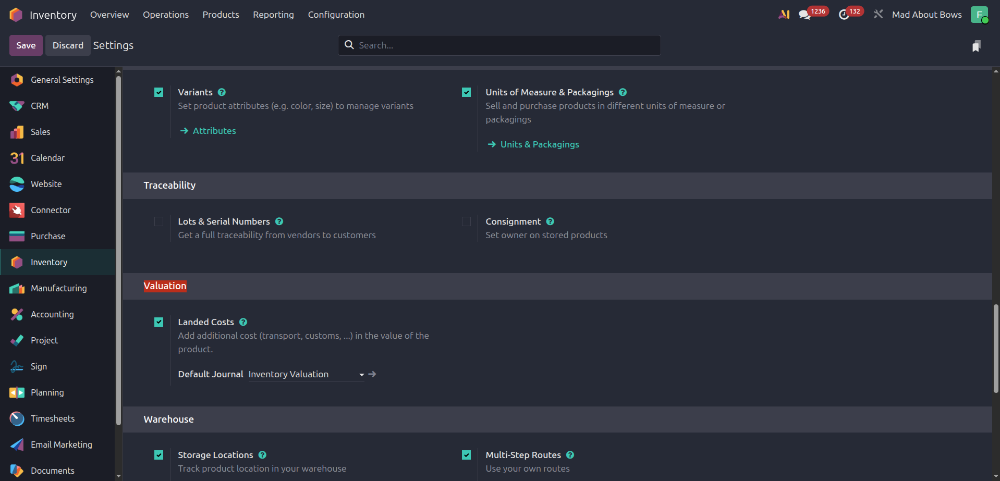

**Recommended settings for Pretti Design company:**

- **Landed Cost**: Enabled (True) - This setting allows you to add extra costs
  (such as shipping and insurance) to the value of products
- **Default Journal**: Inventory Valuation - The journal used to record changes
  in inventory value

Managing Warehouses
++++++++++++++++++++++++++++

A warehouse is a physical location where products are stored. Odoo allows you to
manage multiple warehouses.

To create or manage warehouses, follow this path:

**Inventory app** → **Configuration** → **Warehouses**

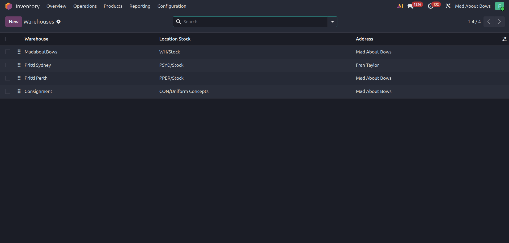

In each warehouse, you can define specific settings:

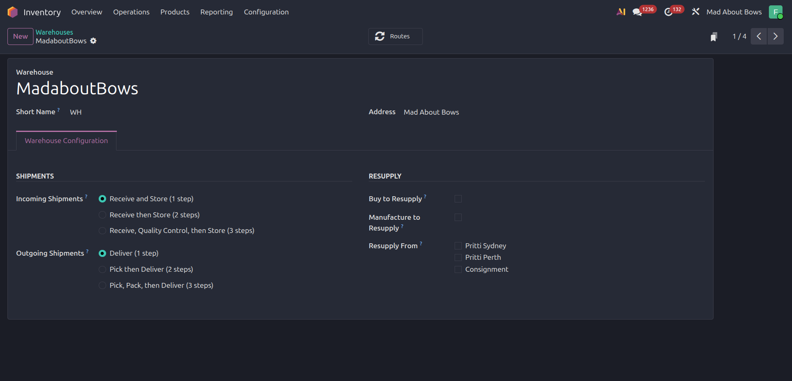

**Most important settings:**

- **Inventory Key**: A unique code to identify the warehouse
- **Input Location**: Where received goods are moved to
- **Output Location**: Where sold goods are taken from

Storage Locations
+++++++++++++++++++++++++++++

A location is a more precise point defined inside a warehouse. For example, a warehouse
might have different shelves, special compartments for hot or cold items, and so on.

To create or manage locations, follow this path:

**Inventory app** → **Configuration** → **Locations**

The image below shows the locations of Pretti Design company:

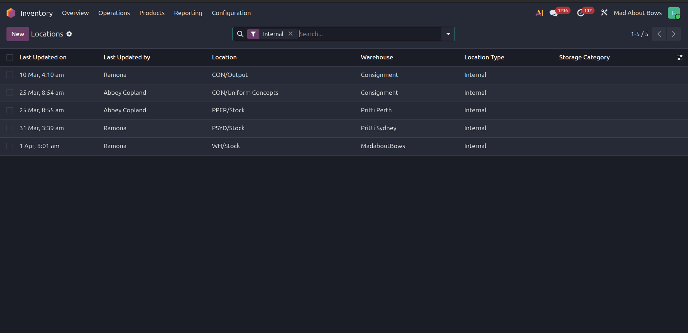

**Location naming:**

At Pretti Design, locations are named using this pattern:

.. code-block:: text

    {Warehouse Key}/Stock

For example: ``WH01/Stock`` or ``WH02/Stock``

**Location settings:**

Each location has special settings that are important for periodic counting:

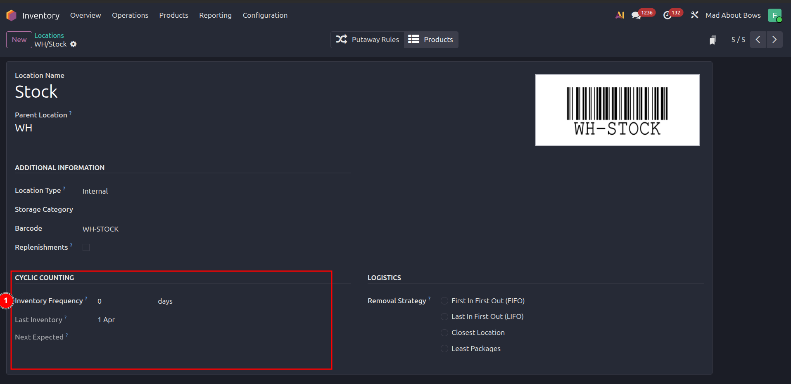

In the image above, point number 1 shows:

- **Inventory Frequency**: Determines how often the warehouse should be counted
- **Last Inventory Date**: Recorded automatically
- **Next Inventory Date**: Calculated based on the frequency

.. note::

    If inventory counting is done periodically (for example, every 3 months), these
    settings help you count the warehouse on time.

Product Categories
+++++++++++++++++++++++++++++

A category is a powerful tool for organizing products. Each category can have its own
settings that apply to all products in that category.

To manage categories, follow this path:

**Inventory app** → **Configuration** → **Product Categories**

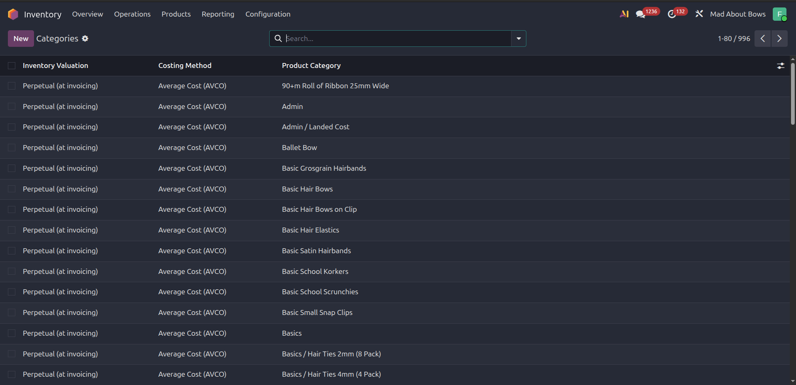

**Why categories are important:**

Product categories are very important for the inventory valuation process. Settings such as
the valuation method (FIFO, LIFO, Weighted Average) and the journal for transfers are
defined in the category.

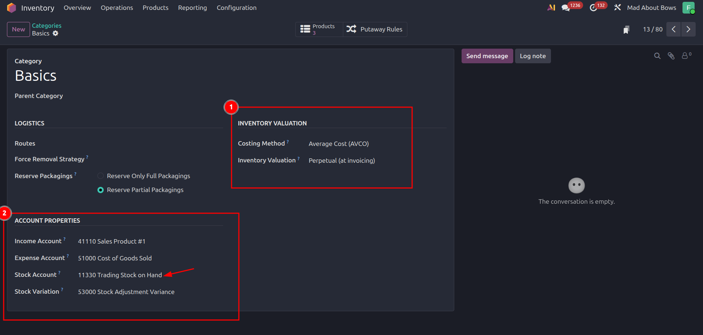

**Recommended category structure:**

Product categories have a hierarchical structure. Odoo uses this structure to inherit
settings. We recommend using these main categories:

.. code-block:: text

    All (Main)
    ├── Purchase
    ├── Sale
    ├── Shipping
    └── Consumable

**Best practice:**

Move all other categories to the e-commerce section. This makes the system simpler
and easier to manage.

.. note::

    The **Inventory Valuation** field is normally set to **Real Time** (or Perpetual).
    This means that whenever inventory changes, an accounting record is created automatically.

Product Settings
+++++++++++++++++++++++++++

Products are the core of the inventory system. Correct product settings affect the
accuracy of the valuation process.

To set up products, follow this path:

**Inventory app** → **Products** → **Products**

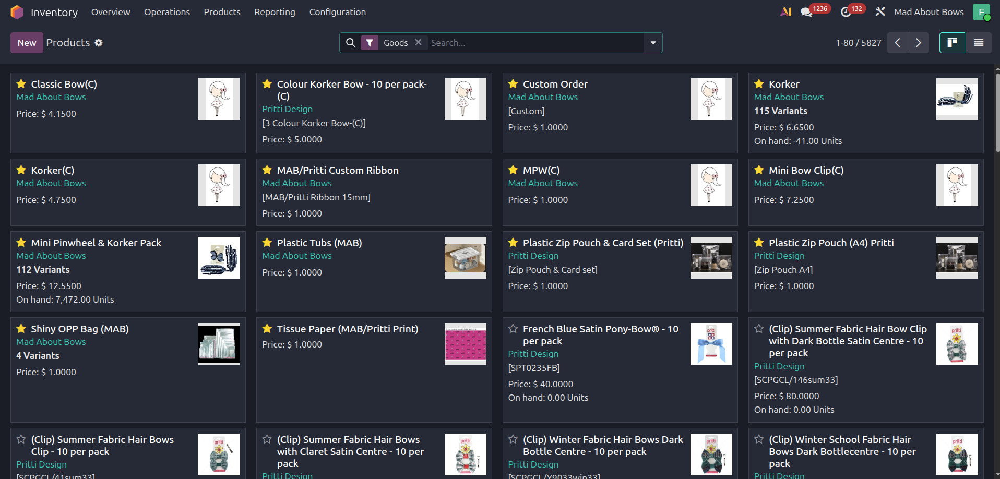

**Open and configure a product:**

Select the product you want to configure to open its settings form:

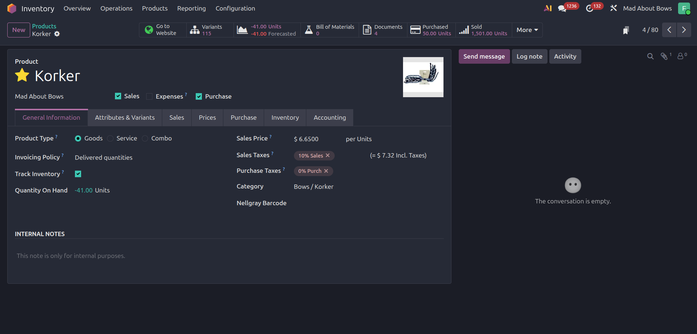

**Recommended settings for a sellable and traceable product:**

- **Sale**: Enabled
- **Purchase**: Enabled
- **Product Type**: Good (Physical product)
- **Track Inventory**: Enabled
- **Category**: All / Sale or another suitable category

**Important note:**

Other settings such as the valuation method are automatically inherited from the product
category. This simplifies the work and ensures that all products in a category have the
same settings.

Accounting Settings for Inventory
+++++++++++++++++++++++++++

After setting up the warehouse, products, and categories, you need to prepare accounting
to receive inventory data. These settings create a connection between the inventory and
accounting modules.

To access these settings, follow this path:

**Accounting app** → **Configuration** → **Settings**

.. warning::

    These settings are only available in the **Enterprise** version of Odoo.
    If you use the **Community** version, these features are not available.

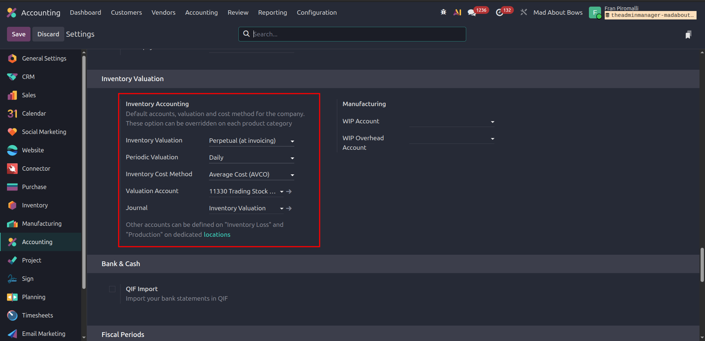

**Recommended settings:**

- **Inventory Valuation**: Real Time (Perpetual)

  This means that inventory changes are immediately recorded in accounting.

- **Periodic Valuation**: Daily

  How often to recalculate inventory value.

- **Inventory Cost Method**: Average Cost (AVCO)

  A method to calculate the average value of products. Other methods are FIFO and LIFO.

- **Journal**: Inventory Valuation

  The journal used to record inventory entries.

Part Two: Counting and Physical Inventory Process
======================================================================================

Now that the settings are complete, we can start the actual inventory counting and
adjustment process.

Pretti Design uses the **on-demand counting** method. This means that inventory
adjustment is not periodic. Instead, it is done whenever needed. For this reason,
warehouse settings are set to **Real Time (Perpetual)**.

**Ways to enter counting data:**

Odoo supports two ways to enter counting data:

1. **Manual method**: For small counts or specific items
2. **Excel file method**: For large counts or batch entries

Method One: Manual Counting
+++++++++++++++++++++++++++++

This method is suitable for small counts or when there are few products.

**Steps:**

1. Open this menu:

   **Inventory app** → **Operations** → **Physical Inventory**

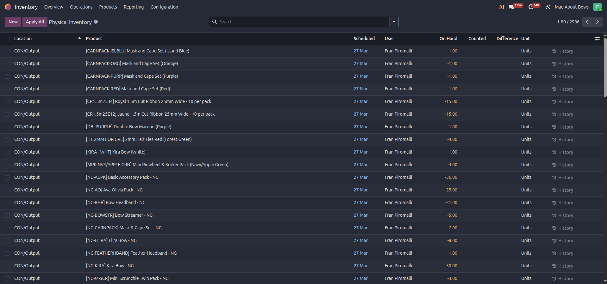

2. To create a new count, click the **Create** button.

3. Add new rows. In each row, enter the following information:

   - **Location**: The place where counting is done
   - **Product**: The item being counted
   - **Schedule Date**: Expected counting date
   - **User**: The person doing the count
   - **Counted Quantity**: The actual quantity found

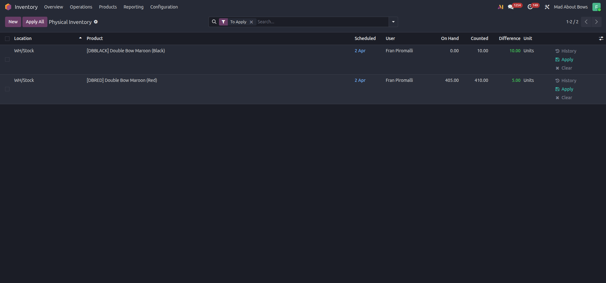

4. After entering all rows, click the **Apply all** button at the top.

5. A wizard window opens:

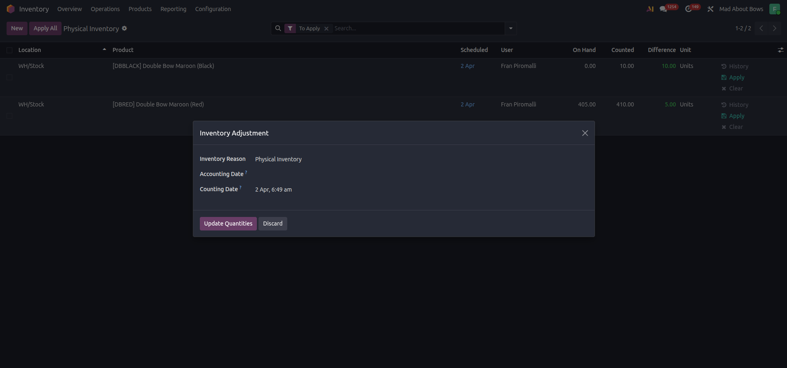

6. In this window, enter the following information:

   - **Inventory Reason**: Why you are doing the count (for example: periodic count,
     correction count)
   - **Accounting Date**: The date when the accounting record should be recorded
   - **Counting Date**: The date when the count was actually done

7. Click the **Update Quantity** button.

.. tip::

    If there is a difference between the system quantity and the counted quantity,
    Odoo automatically creates a transfer document.

Method Two: Counting with Excel File
+++++++++++++++++++++++++++++

This method is very useful for large counts or when you have a lot of data. With this
method, you can prepare data in Excel and then import it in bulk.

**Steps:**

1. Go back to the Physical Inventory page and click the **Import** button.

2. Create an Excel file with these columns:

   - **Location / External ID**: External ID of the location
   - **Product / External ID**: External ID of the product
   - **User / External ID**: External ID of the user
   - **Schedule Date**: Counting date
   - **Counted Quantity**: Quantity counted

   Example:

   .. code-block:: text

       Location/External ID  | Product/External ID | User/External ID | Schedule Date | Counted Quantity
       WH01/Stock            | PROD001            | USER1           | 2024-01-15    | 50
       WH01/Stock            | PROD002            | USER1           | 2024-01-15    | 30

3. Save the Excel file and upload it in the Import page in Odoo.

4. After successful upload, follow the same final steps as the manual method (steps 4-7).

.. note::

    The Excel file must be set up correctly. Column names and data must match Odoo exactly.

Part Three: Reports and Monitoring
======================================================================================

Reports not only show the current situation. They also help identify and solve problems.
In this section, we examine two important reports.

Move History Report
++++++++++++++++++++++++++++

This report shows a complete list of all transfers done in the warehouse. For each
product, its transfers are recorded.

To access this report, follow this path:

**Inventory app** → **Reporting** → **Move history**

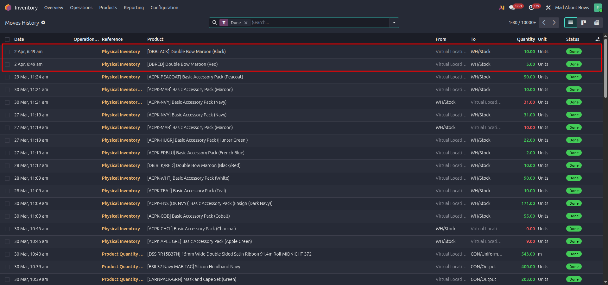

**How to use this report:**

- This report is useful for tracking transfer history.
- You can filter by date, product, or location.
- Each transfer shows the quantity, source, and destination.

Accounting Journal Entries Report
++++++++++++++++++++++++++++

Each count and adjustment creates one or more accounting entries. These entries record
the changes in inventory value in the accounting system.

To access these entries, follow this path:

**Accounting app** → **Reporting** → **Journal Entries**

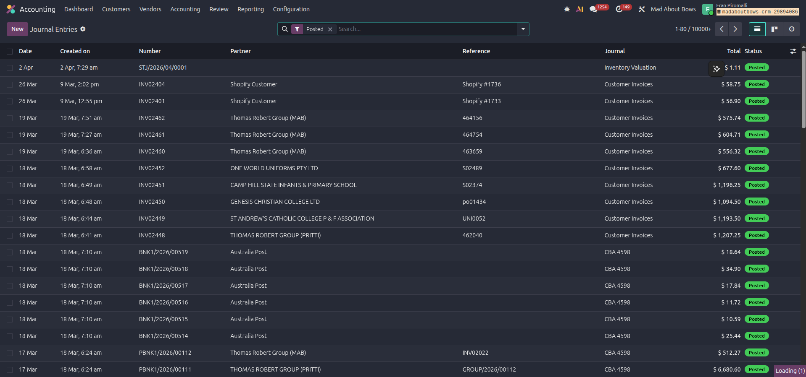

To see the details of an entry, click on it:

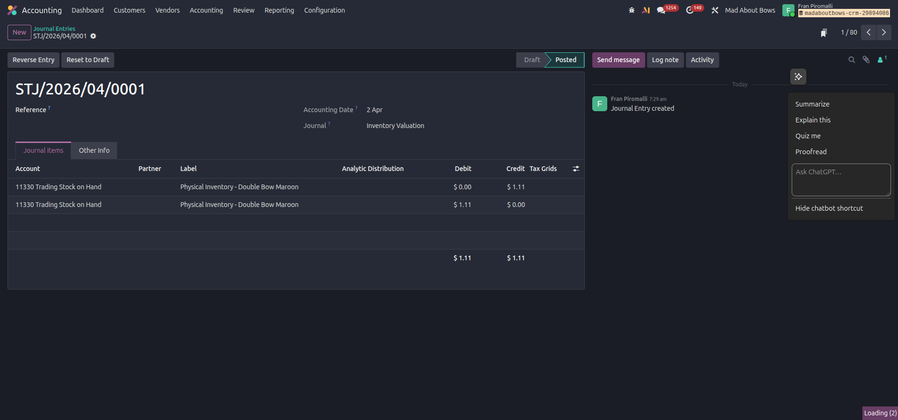

**How to read an accounting entry:**

An accounting entry for inventory adjustment normally includes:

- **Entry Date**: The date when the inventory change was approved
- **Description**: A brief description of the adjustment
- **Accounts**: Shows the accounts and amounts (debit and credit)
- **Reference**: Link to the inventory document
- **Status**: Posted (recorded) or Draft (not recorded)

Best Practices for Implementation
======================================================================================

To successfully carry out the inventory valuation process, follow these recommendations:

1. **Initial Setup**: Before starting, make sure all settings (warehouse, locations,
   categories, and accounting) are correct.

2. **Team Training**: Train all employees involved in the process to enter correct
   and accurate data.

3. **Regular Monitoring**: Regularly review reports and check for inventory differences.

4. **Document the Reason**: For each count, record a clear reason. This helps you
   identify problems later.

5. **Regular Backups**: Regularly back up your accounting and inventory data.

6. **Periodic Review**: At the end of each accounting period, review the entire
   process to ensure everything is correct.
