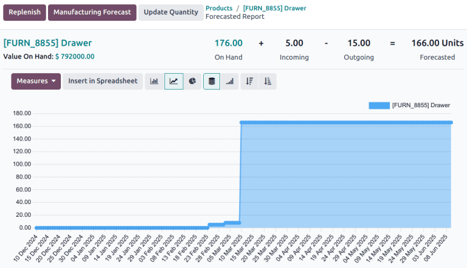
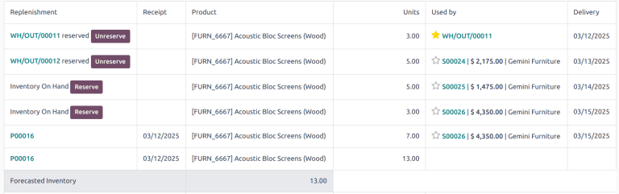

نمای Forecast محصول و نحوه پیاده‌سازی داده‌ها در Odoo
========================================================================================

یکی از نماهایی که باری محصول استفاده می‌شود نمای focast هست که در اون اطلاعات متفاوتی
از محصول نمایش داده می‌شود. می‌خواهم در این بخش تمام اجزای این نما رو نشون بدیم
و به صورت کامل توضیح بدیم

این صفحه همان `Forecasted Report` در انبار است که برای یک محصول نشان می‌دهد:

- الان چه مقدار موجودی واقعی داریم
- چه مقدار ورودی در راه داریم
- چه مقدار خروجی برنامه‌ریزی شده داریم
- و در نهایت موجودی پیش‌بینی‌شده چقدر می‌شود

اجزای اصلی صفحه
----------------------------------------------------------------------------------------

در بالای صفحه یک فرمول کلی نشان داده شده است. این فرمول کلی وضعیت محصول را در انبار
به صورت تجمیع شده نشان می‌دهد. این فرمول شامل اطلاعات زیر است:

- **On Hand**: موجودی واقعی فعلی (`qty_available`)
- **Incoming**: ورودی‌های باز (`incoming_qty`)
- **Outgoing**: خروجی‌های باز (`outgoing_qty`)
- **Forecasted**: مقدار پیش‌بینی‌شده (`virtual_available`)

.. image:: images/forecast-chart.png
   :alt: Forecasted Report - Formula

بر اساس این داده‌ها فرمولی که در بالای صفحه نمایش داده می‌شود به صورت زیر است.

.. math::

    Forecasted = On Hand + Incoming - Outgoing

تمام داده‌هایی که در قسمت‌های دیگر این نما آورده شده است در حقیقت می‌خواهد جزئیات این
فرمول را تعیین کند.
در ادامه هر کدام از بخش‌ها را بررسی می‌کنیم.

جزئیات Forecast - جدول پایین
----------------------------------------------------------------------------------------

هر سطر جدول یک وضعیت تامین برای یک تقاضای خروج را نشان می‌دهد:

- **Reserved**: مقدار از قبل رزرو شده
- **Inventory On Hand / Free Stock**: از موجودی آزاد تامین می‌شود
- **Stock in Transit**: موجودی در مسیر/ترانزیت
- **Not Available**: کمبود داریم

ستون‌هایی که در این جدول در نظر گرفته شده است عبارتند از:

- **Replenishment**: نوع تامین
- **Receipt**: تاریخ ورودی مرتبط
- **EA**: مقدار
- **Used by**: سند مصرف‌کننده (مثلاً فروش)
- **Delivery**: تاریخ تحویل/خروج

در حقیقت این جدول نشان می‌دهد که هر خروجی چطور می‌تواند تامین و در چه تاریخی انجام خواهد
شد.
اطلاعات این جدول بر اساس stock.move.line محاسبه می‌شود.

«چه مقدار برای چه کاری رزرو شده» چطور تعیین می‌شود؟
----------------------------------------------------------------------------------------

این منطق در `stock/report/stock_forecasted.py` پیاده شده و متد کلیدی آن:
 `_get_report_lines(...)`
 است.

روند کلی:

1. خروجی‌ها (`outs`) و ورودی‌ها (`ins`) در محدوده انبار انتخاب می‌شوند.
2. برای هر خروجی، زنجیره حرکت‌های upstream با `out._rollup_move_origs()` بررسی می‌شود.
3. اگر حرکت upstream در حالت `assigned` یا `partially_available` باشد، مقدار رزرو از آن
    برداشت می‌شود و خط `reserved` ساخته می‌شود.
4. اگر تقاضا باقی بماند، به ترتیب از موارد زیر پوشش داده می‌شود:
    - موجودی آزاد
    - موجودی ترانزیت
    - ورودی‌ها
5. اگر باز هم تقاضا تامین نشود، خط `Not Available` ثبت می‌شود.

چرا ستون Used by می‌گوید این رزرو برای کدام سند است؟
----------------------------------------------------------------------------------------

در خط خروجی، Odoo از `move_out._get_source_document()` استفاده می‌کند.

- در `stock` به طور پیش‌فرض سند اصلی Picking برمی‌گردد.
- در `sale_stock` این رفتار با `sale_line_id` گسترش پیدا می‌کند تا ارتباط با فروش
  قابل مشاهده باشد.

به همین دلیل در نما می‌توانید ببینید هر مقدار خروج/رزرو برای چه سفارش یا چه سندی مصرف می‌شود.

نمودار Forecast از کجا می‌آید؟
----------------------------------------------------------------------------------------

نمودار خطی بالای جدول از مدل گزارش SQL به نام `report.stock.quantity` می‌آید:

- فایل: `stock/report/report_stock_quantity.py`
- view: `report_stock_quantity`

این view داده‌ها را روزانه و در سه state می‌سازد:

- `forecast`
- `in`
- `out`

و کامپوننت فرانت‌اند با domain مربوط به محصول و انبار، فقط state=`forecast` را برای نمودار می‌خواند.

جمع‌بندی کاربردی
----------------------------------------------------------------------------------------

- این نما فقط عدد کل نمی‌دهد؛ دقیقاً نشان می‌دهد تقاضا از چه منبعی تامین شده.
- اگر `Not Available` می‌بینید یعنی بعد از رزرو + موجودی آزاد + ترانزیت + ورودی‌ها هنوز کسری دارید.
- بنابراین همین گزارش بهترین نقطه برای تحلیل «چرا Forecast منفی شده» و «کدام سفارش‌ها باعث کمبود شده‌اند» است.
